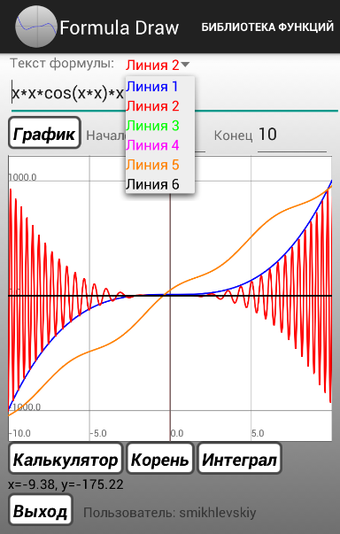
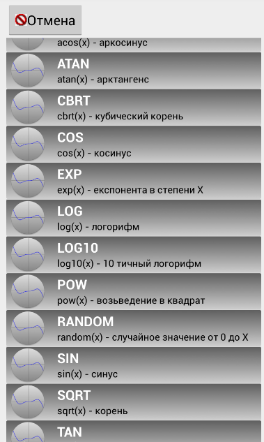

# FormulaDraw
1) Calckulate user's formula by Reverse Polish Notation(RPN).  
2) Draw graphic user's formulas.  
3) Calck Integral.  
4) Find root.  
5) Save text formulas in prefences.  
6) Save formulas in parse cloud.  
7) Make user's function and save its in parse cloud  & possibility(To-Do).  
8) Send graphics view by Email (TO-DO).  
9) Function approximation of the user data table with possibility out graphics(TO-DO).  
10) Сalculator conversion of physical quantities(TO-DO).  
  
  
Main Screen  

  
List of functions    

